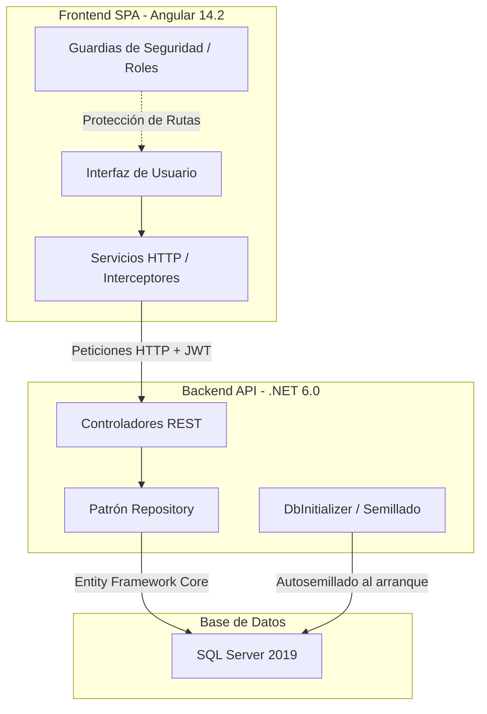

# DentAgend: Sistema de administración de reservaciones odontológicas


Plataforma diseñada para la gestión automatizada de citas clínicas, historias odontológicas y flujos administrativos en consultorios de salud dental.

---

## Disponibilidad y demostración

**Sistema en línea:** https://sistema-odontologico-seven.vercel.app/.

El acceso de evaluación al sistema se realiza mediante la cuenta de paciente preconfigurada:

Correo: `paciente@gmail.com`

Contraseña: `123456`

También se puede registrar una nueva cuenta con validación de código OTP por correo electrónico.

---

## Arquitectura del sistema

El sistema implementa una arquitectura desacoplada cliente-servidor distribuida en dos entornos independientes.

El backend utiliza el patrón de diseño Repository en conjunto con Entity Framework Core sobre ASP.NET Core 6.0.

El frontend se estructura como una Single Page Application (SPA) basada en Angular 14.2, utilizando interceptores HTTP para inyectar credenciales JWT y guardias de ruta para la protección de módulos por rol.



---

## Componentes principales

* **Módulo de autenticación y autorización (JWT & OTP):** Controla el registro de pacientes, la validación de identidad a través de códigos OTP de un solo uso enviados por correo electrónico, y la generación de tokens JWT para la posterior autorización de endpoints.
* **Controlador general de reservaciones:** Gestiona la lógica de creación, modificación, asignación de odontólogos y cancelación de citas odontológicas respetando las restricciones de horarios disponibles.
* **Generador de reportes clínicos (PDF):** Compila el historial de consultas médicas y estadísticas de facturación directamente a documentos PDF exportables empleando la librería pdfmake.
* **Visualizador dinámico de datos (Dashboard):** Renderiza resúmenes numéricos y gráficos estadísticos interactivos sobre la facturación acumulada e ingresos del consultorio dental.

---

## Lógica de negocio y roles

| Rol de usuario | Módulos Autorizados | Operaciones Permitidas | Reglas de Negocio Clave |
| :--- | :--- | :--- | :--- |
| **Paciente** | Dashboard, Citas | Crear y listar citas personales | Requiere validación de cuenta por correo (código OTP) para registrar solicitudes. |
| **Administrador** | Dashboard completo, Citas globales, Reportes, Usuarios, Servicios | Control total (CRUD) de pacientes, médicos, servicios y asignaciones | El semillado inicial crea la cuenta maestra del administrador de forma automática. |
| **Odontólogo** | Citas asignadas | Consultar y actualizar estado de citas programadas | Limitado a visualizar únicamente las citas donde figura como médico tratante. |

---

## Distribución de módulos y roles

El sistema restringe las vistas y la navegación de acuerdo al rol asignado a la cuenta autenticada.

* **Módulos del paciente:**
  * **Dashboard:** Resumen visual de citas agendadas y estados de reservación.
  * **Citas:** Solicitud de consultas seleccionando servicio, odontólogo, fecha y hora.

* **Módulos del administrador:**
  * **Dashboard:** Indicadores financieros de facturación y gráficos comparativos de barras.
  * **Catálogos Clínicos:** Operaciones de control (CRUD) sobre usuarios, pacientes, odontólogos y servicios.
  * **Calendario de Citas:** Consola de supervisión de citas agendadas a nivel global.
  * **Reportes:** Módulo de exportación de historial clínico e informes en formato PDF.

### Flujo de registro de citas

1. Autenticar la sesión empleando las credenciales de prueba o mediante la creación de un nuevo perfil.
2. Acceder al módulo **Citas** situado en la barra lateral de navegación.
3. Accionar el botón de registro de nueva cita clínica.
4. Definir el tratamiento odontológico requerido, el médico disponible, la fecha y la hora.
5. Confirmar el almacenamiento para listar de forma inmediata la reservación en el historial personal.

---

## Estructura del repositorio

```
.
├── SistemaOdontologicoBakend/              # Carpeta raíz del servidor de base de datos y lógica de negocio
│   └── SistemaOdontologico/                # Proyecto principal de ASP.NET Core 6.0
│       ├── Controllers/                    # Endpoints expuestos de la API REST
│       ├── DTO/                            # Objetos de Transferencia de Datos
│       ├── Models/                         # Modelos de Entity Framework Core y Base de Datos
│       ├── Repository/                     # Interfaces y clases del patrón Repository
│       ├── Utilidades/                     # Componentes de soporte (OTP, envío de correos, JWT)
│       └── Program.cs                      # Punto de entrada de la aplicación y configuración de inyección
└── SistemaOdontologicoFrontend/             # Carpeta raíz del cliente SPA
    └── src/
        └── app/
            ├── components/                 # Componentes visuales (Login y vistas del panel)
            │   └── pages/                  # Vistas por rol (Citas, Usuarios, Reportes, Dashboard)
            ├── interceptors/               # Interceptores para autenticación de peticiones
            ├── interfaces/                 # Tipados y modelos de datos
            └── servicios/                  # Servicios de comunicación HTTP con el Backend
```

---

## Instalación y ejecución Local

### Prerrequisitos
- .NET 6.0 SDK instalado localmente.
- Node.js (versión 16.x o 18.x compatible con Angular 14.2).
- Servidor SQL Server en ejecución.

### Paso 1: Configuración de base de datos
Ajustar la cadena de conexión local dentro del archivo `appsettings.json` en `SistemaOdontologicoBakend/SistemaOdontologico/`:
```json
"ConnectionStrings": {
  "cadenaSQL": "Server=TU_SERVIDOR;Database=SistemaOdontologicoDB;Trusted_Connection=True;"
}
```

> [!TIP]
> El sistema incluye un inicializador de base de datos (`DbInitializer`) que creará las tablas, los roles, los servicios y el usuario administrador de prueba automáticamente durante el primer arranque.

### Paso 2: Ejecución del backend
Restaurar dependencias, compilar y arrancar la API mediante consola:
```powershell
cd SistemaOdontologicoBakend\SistemaOdontologico
dotnet restore
dotnet build
dotnet run
```
La documentación interactiva de Swagger estará disponible en `https://localhost:7196/swagger`.

### Paso 3: Ejecución del frontend
Instalar dependencias locales de Node e inicializar el servidor de desarrollo de Angular:
```bash
cd SistemaOdontologicoFrontend
npm install
npm run start
```
El cliente web interactivo se iniciará en `http://localhost:4200/`.
